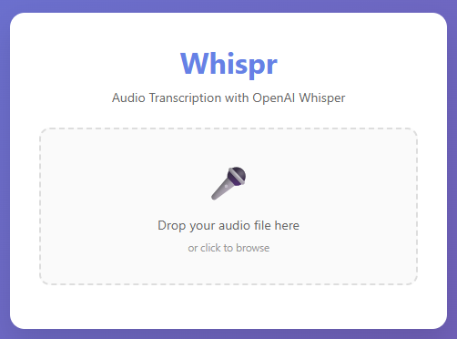
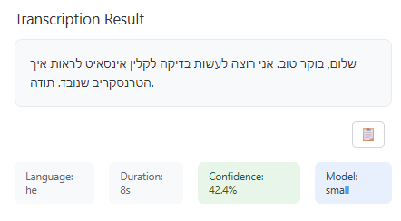
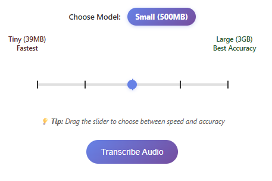

# Whispr - Audio Transcription App

A simple and beautiful web application that transcribes audio files (including iPhone recordings) using OpenAI Whisper.

## 📸 Screenshots

### Main Interface


**Features shown in the screenshot:**
- 🎛️ **Horizontal Slider** for model selection (Tiny → Large)
- 🎤 **Drag & Drop** file upload area
- 🤖 **Model Selection** with visual feedback
- 📋 **Modern Copy Button** for easy text copying
- 🎨 **Beautiful UI** with custom styling

### Transcription Results


**The app provides:**
- 📝 **Clean transcription text** with proper formatting
- 🌍 **Language detection** (optimized for Hebrew)
- ⏱️ **Duration and confidence** metrics
- 🧹 **Automatic cleanup** of temporary files

### Model Selection Slider


**Interactive Elements:**
- 🎯 **Snapping to exact positions** (Tiny, Base, Small, Medium, Large)
- 🎨 **Visual feedback** with highlighted tick marks
- 📊 **Model size information** displayed clearly

---

### 📱 **Screenshots Added!**

Your app now includes real screenshots showcasing:
- **Main Interface** - Beautiful drag & drop interface with horizontal slider
- **Transcription Results** - Clean output with modern copy button
- **Model Selection Slider** - Interactive slider with snapping functionality

**Screenshot files:**
- `screenshots/main-interface.png` - Main app interface
- `screenshots/result.png` - Transcription results display
- `screenshots/slider.png` - Model selection slider

---

## Features

- 🎤 **Drag & Drop Interface**: Easy file upload with drag-and-drop support
- 📱 **iPhone Compatible**: Supports iPhone recording formats (m4a, aac, m4b)
- 🎵 **Multiple Formats**: Supports m4a, mp3, wav, aac, m4b, and mp4 files
- 🤖 **AI-Powered**: Uses OpenAI Whisper for high-quality transcription
- 💻 **Modern UI**: Beautiful, responsive design with progress indicators
- 🔒 **Secure**: Automatic file cleanup after processing
- 📊 **Metadata**: Shows language detection and audio duration

## Supported Audio Formats

- **m4a** - iPhone Voice Memos, iTunes
- **mp3** - Standard audio format
- **wav** - Uncompressed audio
- **aac** - Advanced Audio Coding
- **m4b** - Audiobook format
- **mp4** - Video with audio

## Installation

### Prerequisites

- Python 3.8 or higher
- pip (Python package installer)

### Quick Start (Windows)

1. **Use the provided installation scripts:**
   - **Easy Install**: Double-click `install_dependencies.bat`
   - **PowerShell**: Right-click `install_dependencies.ps1` → "Run with PowerShell"
   - **Conda Alternative**: If you have Anaconda, use `install_conda.bat`

2. **Start the app:**
   - Double-click `start.bat` or run `start.ps1`

### Manual Setup

1. **Clone or download this repository**
   ```bash
   git clone <repository-url>
   cd ClinInsight
   ```

2. **Create a virtual environment (recommended)**
   ```bash
   python -m venv venv
   
   # On Windows
   venv\Scripts\activate
   
   # On macOS/Linux
   source venv/bin/activate
   ```

3. **Install dependencies**
   ```bash
   pip install -r requirements.txt
   ```

   **Note**: The first time you run the app, it will download the Whisper model (~150MB for base model).

## Usage

### Starting the Application

1. **Run the Flask app**
   ```bash
   python app.py
   ```

2. **Open your browser**
   Navigate to `http://localhost:5000`

### Using the App

1. **Upload Audio File**
   - Drag and drop your audio file onto the upload area, or
   - Click the upload area to browse and select a file

2. **Transcribe**
   - Click the "Transcribe Audio" button
   - Wait for processing (this may take several minutes depending on file size)

3. **View Results**
   - The transcription text will appear below
   - Metadata including detected language and duration is shown

## Configuration

### Whisper Model Selection

You can change the Whisper model size in `app.py`:

```python
# Available models: "tiny", "base", "small", "medium", "large"
model = whisper.load_model("base")  # Change this line
```

- **tiny**: Fastest, least accurate (~39MB)
- **base**: Good balance of speed/accuracy (~150MB)
- **small**: Better accuracy, slower (~500MB)
- **medium**: High accuracy, slower (~1.5GB)
- **large**: Best accuracy, slowest (~3GB)

### File Size Limits

The default file size limit is 100MB. You can modify this in `app.py`:

```python
app.config['MAX_CONTENT_LENGTH'] = 100 * 1024 * 1024  # 100MB
```

## Troubleshooting

### Common Installation Issues

#### 1. **"Getting requirements to build wheel did not run successfully" Error**

This is a common Windows issue with `openai-whisper`. Try these solutions:

**Solution A: Use the provided installation scripts**
- Run `install_dependencies.bat` or `install_dependencies.ps1`
- These scripts use alternative installation methods

**Solution B: Install PyTorch CPU version first**
```bash
pip install torch torchaudio --index-url https://download.pytorch.org/whl/cpu
pip install openai-whisper
```

**Solution C: Use Conda (recommended for Windows)**
```bash
conda create -n clininsight python=3.9
conda activate clininsight
conda install -c conda-forge openai-whisper
```

**Solution D: Upgrade pip and build tools**
```bash
python -m pip install --upgrade pip setuptools wheel
pip install openai-whisper --no-cache-dir
```

#### 2. **Visual C++ Build Tools Error**

If you see "Microsoft Visual C++ 14.0 is required":
- Install Visual Studio Build Tools: https://visualstudio.microsoft.com/visual-cpp-build-tools/
- Or use the conda installation method above

#### 3. **Other Common Issues**

1. **"No module named 'whisper'"**
   - Make sure you've installed requirements: `pip install -r requirements.txt`
   - Try the alternative installation scripts provided

2. **Model download fails**
   - Check your internet connection
   - The model will be downloaded automatically on first use

3. **Transcription is slow**
   - Use a smaller Whisper model (tiny/base instead of medium/large)
   - Smaller audio files process faster

4. **Memory errors**
   - Reduce the Whisper model size
   - Ensure you have at least 2GB RAM available

### Performance Tips

- **For quick testing**: Use the "tiny" model
- **For production use**: Use "base" or "small" model
- **For best quality**: Use "medium" or "large" model (requires more RAM)

## File Structure

```
ClinInsight/
├── app.py                      # Main Flask application
├── requirements.txt            # Python dependencies
├── templates/                  # HTML templates
│   └── index.html             # Main UI template
├── uploads/                    # Temporary upload directory (auto-created)
├── install_dependencies.bat    # Windows dependency installer
├── install_dependencies.ps1    # PowerShell dependency installer
├── install_conda.bat          # Conda-based installer
├── start.bat                   # Windows startup script
├── start.ps1                   # PowerShell startup script
├── demo.py                     # Command-line demo script
├── config.py                   # Configuration file
└── README.md                   # This file
```

## Security Notes

- Files are automatically deleted after processing
- Maximum file size is limited to prevent abuse
- Only audio/video files are accepted
- Change the secret key in production

## Production Deployment

For production use, consider:

1. **Change the secret key** in `app.py`
2. **Use a production WSGI server** like Gunicorn
3. **Set up HTTPS** for secure file uploads
4. **Configure proper logging**
5. **Set up monitoring** for the transcription service

## License

This project is open source and available under the MIT License.

## Contributing

Feel free to submit issues, feature requests, or pull requests to improve the application.

---

**Note**: This application uses OpenAI Whisper for transcription. The first run will download the AI model, which may take some time depending on your internet connection.

**Windows Users**: If you encounter installation issues, use the provided `install_dependencies.bat` or `install_conda.bat` scripts for better compatibility.
