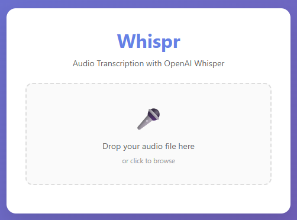
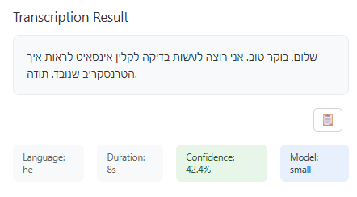
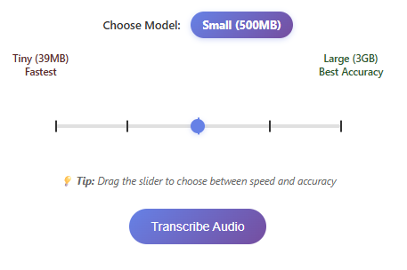

# Flask App - Whispr Audio Transcription

This folder contains the Flask web application version of Whispr.

## What's Inside
- `app.py` - Main Flask application with REST API endpoints
- `templates/` - HTML templates for the web interface
- `requirements.txt` - Python dependencies for Flask version
- `screenshots/` - Visual examples of the Flask interface
- `uploads/` - Directory for temporary file uploads (auto-created)
- `demo.py` - Command-line demo script for testing transcription
- `start.bat` - Windows batch file to start the Flask app
- `start.ps1` - PowerShell script to start the Flask app
- `install_conda.bat` - Conda-based dependency installer
- `install_dependencies.bat` - Windows batch file for dependencies
- `install_dependencies.ps1` - PowerShell script for dependencies

## Features
- Web-based audio file upload interface
- REST API endpoints for transcription
- File handling and cleanup
- Runs on port 8000
- Beautiful drag & drop interface with model selection slider

## Screenshots

### Main Interface


**Features shown in the screenshot:**
- 🎛️ **Horizontal Slider** for model selection (Tiny → Large)
- 🎤 **Drag & Drop** file upload area
- 🤖 **Model Selection** with visual feedback
- 📋 **Modern Copy Button** for easy text copying
- 🎨 **Beautiful UI** with custom styling

### Transcription Results


**The app provides:**
- 📝 **Clean transcription text** with proper formatting
- 🌍 **Language detection** (optimized for Hebrew)
- ⏱️ **Duration and confidence** metrics
- 🧹 **Automatic cleanup** of temporary files

### Model Selection Slider


**Interactive Elements:**
- 🎯 **Snapping to exact positions** (Tiny, Base, Small, Medium, Large)
- 🎨 **Visual feedback** with highlighted tick marks
- 📊 **Model size information** displayed clearly

## How to Run

### Option 1: Manual Setup
```bash
cd flask-app
pip install -r requirements.txt
python app.py
```

### Option 2: Use Installation Scripts (Windows)
- **Easy Install**: Double-click `install_dependencies.bat`
- **PowerShell**: Right-click `install_dependencies.ps1` → "Run with PowerShell"
- **Conda Alternative**: If you have Anaconda, use `install_conda.bat`

### Option 3: Use Startup Scripts
- **Windows**: Double-click `start.bat`
- **PowerShell**: Right-click `start.ps1` → "Run with PowerShell"

The app will be available at `http://localhost:8000`

## Demo Script
Run `demo.py` to test the transcription functionality from the command line:
```bash
python demo.py
```

## Dependencies
- Flask web framework
- faster-whisper for audio transcription
- werkzeug for file handling
